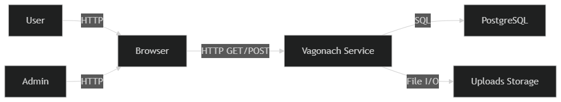
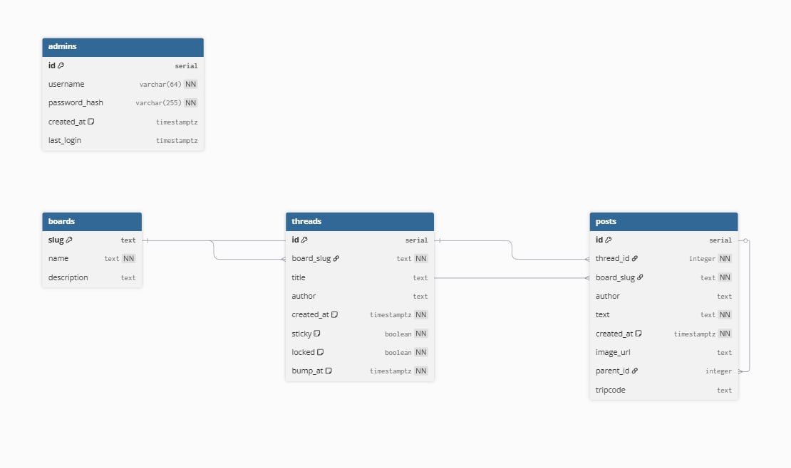

# Vagonach

**Vagonach** — минималистичный анонимный форум (imageboard), ориентированный на высокую производительность, серверный рендеринг и простоту развёртывания.
Проект вдохновлён классическими имиджбордами (2channel, 4chan) и сознательно избегает тяжёлых клиентских фреймворков.

---

## Участники проекта

* **Саламатов Иван**
* **Юрьев Богдан**
* **Федунов Владимир**

---

## 1. Определение проблемы

Современные форумы и социальные сети перегружены избыточным функционалом, сложной клиентской логикой и рекламными механизмами, что приводит к увеличению времени загрузки страниц и росту требований к серверному и клиентскому оборудованию. При этом сохраняется устойчивый спрос на простой, быстрый и анонимный формат общения.


---

## 2. Выработка требований — пользовательские сценарии

### Основные возможности

* Просмотр досок, тредов и постов без регистрации
* Анонимная публикация тредов и сообщений
* Поддержка изображений
* Веб-интерфейс администратора для модерации контента

### Пользовательские сценарии

1. **Просмотр (Reader)**
   Пользователь заходит на главную страницу, просматривает список досок и активных тредов и открывает интересующую дискуссию.

2. **Публикация (Poster)**
   Пользователь создаёт новый тред или отвечает в существующем, прикрепляя изображение, без необходимости регистрации.

3. **Навигация**
   Пользователь видит список последних активных тредов для быстрого доступа к текущим обсуждениям.

4. **Администрирование**
   Администратор через веб-интерфейс удаляет спам, закрепляет важные треды или закрывает обсуждения.

---

## 3. Архитектура проекта

### 3.1 Стек технологий

**Backend**

* Go (Golang) — HTTP-сервер, бизнес-логика, конкурентная обработка запросов
* PostgreSQL — хранение досок, тредов, постов и административных данных

**Frontend**

* HTML Templates — серверный рендеринг страниц
* HTMX — минимальная интерактивность без SPA-фреймворков
* CSS — кастомная стилизация страниц (отдельные стили для досок, тредов и админ-панели)

---

### 3.2 Характер нагрузки

Проект относится к классу **read-heavy систем**.

* **Чтение (~90%)**: главная страница, списки тредов, просмотр тредов и постов
* **Запись (~10%)**: создание тредов, постов и административные действия

---

### 3.3 Оценка трафика

Принята следующая модель нагрузки:

* 10 000 уникальных посетителей в сутки
* 20 просмотров страниц на пользователя
* 2 000 новых постов в сутки
* 400 новых тредов в сутки

**HTML-страницы**

* Средний размер страницы: ~25 KB
* 200 000 pageview × 25 KB ≈ **4.8 GB/сутки**

**HTMX и служебные запросы**

* ~100 000 запросов × 2 KB ≈ **0.2 GB/сутки**

**Изображения**

* 2 000 изображений × 300 KB × 3 просмотра ≈ **1.7 GB/сутки**

**Итого**

* Сервисный трафик: ~**5.0 GB/сутки**
* Общий трафик с изображениями: ~**6.7 GB/сутки**

---

### 3.4 Объёмы дисковой системы

**PostgreSQL**

* Средний размер поста (текст + индексы): ~2 KB
* 2 000 постов/сутки → ~**1.5 GB/год**

**Изображения**

* ~300 KB на файл
* ~2 000 изображений/сутки → ~**200 GB/год**

Основной рост объёма данных обеспечивается медиа-файлами, а не базой данных.

---

## 4. Диаграммы архитектуры

### Рисунок 1 — C4 Context Diagram




### Рисунок 2 — C4 Container Diagram


---

## 5. Контракты API

### 🧵 Boards & Threads (API)

- `GET /boards` — список всех досок
- `GET /boards/:slug/threads` — список тредов выбранной доски
- `POST /boards/:slug/threads` — создание нового треда
- `PATCH /threads/:id/sticky` — установить/снять закрепление треда
- `PATCH /threads/:id/lock` — открыть/закрыть тред
- `DELETE /threads/:id` — удалить тред

### 💬 Posts (API)

- `GET /threads/:id/posts` — список постов треда
- `POST /threads/:id/posts` — создание нового поста
- `GET /posts/:id` — просмотр отдельного поста (API)
- `DELETE /posts/:id` — удалить пост

### 🔐 Admin Panel

- `GET /admin/login` — страница входа администратора
- `POST /admin/login` — отправка формы входа
- `GET /admin/logout` — выход администратора
- `GET /admin` — административная панель (требует авторизации)
- `POST /admin/threads/:id/delete` — удалить тред
- `POST /admin/threads/:id/sticky` — закрепить/открепить тред
- `POST /admin/threads/:id/lock` — закрыть/открыть тред

## 6. Нефункциональные требования

### 6.1 Время отклика (SLA)

* Главная страница: ≤ **200 мс**
* Список тредов: ≤ **250 мс**
* Просмотр треда: ≤ **300 мс**
* Создание треда: ≤ **400 мс**
* Создание поста: ≤ **350 мс**
* Админ-действия: ≤ **300 мс**

### 6.2 Пропускная способность

* Средняя нагрузка: до **100 RPS**
* Пиковая нагрузка: до **300 RPS**

### 6.3 Надёжность и консистентность

* PostgreSQL используется как источник истины
* Операции записи выполняются транзакционно
* Приложение stateless и допускает быстрый рестарт

### 6.4 Безопасность

* Доступ к админ-панели только после аутентификации
* Валидация входных данных
* Ограничения на размер и тип загружаемых файлов
* Базовое rate limiting для операций записи

---

## 7. Схема базы данных и обоснование




### Обоснование

* Индексы по `board_slug`, `bump_at`, `thread_id` обеспечивают быстрые read-запросы при типичной read-heavy нагрузке
* Запись поста реализуется как короткая транзакция INSERT с обновлением поля `bump_at` у соответствующего треда
* Изображения хранятся в файловой системе сервера (директория `uploads/`), а в базе данных сохраняется только путь к файлу (`image_url`), что снижает нагрузку на БД и индексы
* Поля `tripcode` и `parent_id` поддерживают анонимную идентификацию и ответы на конкретные посты, характерные для классической модели имиджборды


---

## 8. Схема масштабирования сервиса при росте нагрузки в 10 раз

### Горизонтальное масштабирование

**Vagonach Application (Go API + Server-Side Rendering)**  
- Запуск нескольких инстансов Go-приложения за load balancer (nginx / cloud LB).  
- Приложение имеет stateless-архитектуру: состояние не хранится в памяти процесса, что позволяет масштабировать сервис горизонтально без синхронизации между инстансами.  
- Нагрузка равномерно распределяется балансировщиком, каждый инстанс обслуживает ограниченное количество RPS.  
- Использование keep-alive соединений и конкурентной модели Go (goroutines) снижает latency при высокой нагрузке.

**PostgreSQL**  
- Используется схема репликации:
  - **1 primary** — операции записи (создание тредов и постов, действия администратора);
  - **2–3 read replicas** — операции чтения (главная страница, списки тредов, просмотр постов).  
- Read-heavy нагрузка масштабируется за счёт переноса большей части чтений на реплики.  
- Использование connection pooling (например, PgBouncer) снижает накладные расходы на соединения при большом количестве инстансов приложения.

**Медиа-контент (изображения)**  
- При росте нагрузки изображения выносятся из локальной файловой системы в объектное хранилище (S3-совместимое).  
- Использование CDN для кэширования и быстрой раздачи изображений снижает сетевую и дисковую нагрузку на приложение.

---

### Вертикальное масштабирование

- Увеличение ресурсов (CPU, RAM) контейнеров Go-приложения позволяет обрабатывать больше одновременных запросов благодаря эффективной конкурентной модели.  
- Для PostgreSQL увеличение объёма RAM улучшает page cache и работу индексов, а увеличение CPU ускоряет обработку параллельных запросов.  
- Вертикальное масштабирование используется как дополнительная мера до достижения пределов горизонтального масштабирования.

---

### Оптимизация

- **Read-heavy оптимизация:** перенос чтений на read replicas снижает нагрузку на primary БД.  
- **Оптимизация медиа-трафика:** CDN и объектное хранилище уменьшают объём трафика через backend.  
- **Простота архитектуры:** отсутствие тяжёлых фоновых процессов и сложных асинхронных пайплайнов снижает количество узких мест и упрощает масштабирование.


---

## 9. Тестирование

### UNIT тестирование

```bash
go test ./...
```

Для подробного вывода:

```bash
go test -v ./...
```

### Интеграционное тестирование

```bash
go test ./...
```

Тесты предполагают наличие доступной PostgreSQL и корректных параметров подключения.

---

## 10. Сборка и запуск

### Переменные окружения

```bash
export DB_HOST=127.0.0.1
export DB_PORT=5432
export DB_NAME=vagonach_db
export DB_USER=vagonach
export DB_PASS=secret
```

### Сборка

```bash
go build -o vagonach ./cmd/vagonach
```

### Запуск

```bash
./vagonach
```

или

```bash
go run cmd/vagonach/main.go
```

---

## 11. Метрики кодовой базы

* Go: ~1455 строк
* CSS: ~2596 строк
* HTML: ~843 строки
* SQL: ~39 строк

**Всего:** ~5000 строк кода
